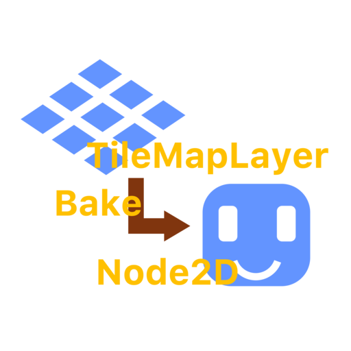

# TileMapLayer Baker



TileMapLayer Baker is a Godot 4 editor plugin that bakes selected static visual `TileMapLayer` nodes into PNG-backed `Sprite2D` backgrounds.

[简体中文说明](docs/README.zh_CN.md)

This plugin is intended for tile layers that are kept for editing convenience but do not need runtime TileMap behavior. Baking large static decoration or background layers can reduce runtime TileMap processing and draw/setup overhead by replacing many tile cells with one or more regular sprites. The source `TileMapLayer` nodes stay in the scene for future editing and re-baking.

The editor UI supports English and Simplified Chinese.

## Screenshots


## Features

- Bake selected `TileMapLayer` nodes into PNG textures.
- Add matching `Sprite2D` nodes under the original parent.
- Combine layers by `z_index`.
- Hide source `TileMapLayer` nodes after baking.
- Re-bake hidden source layers.
- Overwrite matching baked PNG files and sprites.
- English and Simplified Chinese editor UI.

## Why Bake TileMapLayer Nodes

TileMap layers are convenient to edit, but large static visual layers still have runtime cost. If a layer never changes during gameplay and does not provide gameplay data, baking it into a PNG-backed `Sprite2D` can make the scene cheaper to render and simpler to ship.

This is most useful for:

- Background decoration.
- Large floor or wall detail layers.
- Isometric or dense visual-only maps.
- Low-end machines where editor-friendly TileMaps are heavier than a few textures.

## Installation

### From the Godot Asset Library

Install **TileMapLayer Baker** from the Godot Asset Library, then enable it in **Project > Project Settings > Plugins**.

### From Git

Copy this folder into your project:

```text
addons/tilemap_layer_baker
```

Then enable **TileMapLayer Baker** in **Project > Project Settings > Plugins**.

## Usage

1. Open a scene with static visual `TileMapLayer` nodes.
2. Select one or more `TileMapLayer` nodes in the scene tree.
3. Open the **TileMap Baker** dock.
4. Set the output directory, or keep `res://assets/baked`.
5. Click **Bake Selected TileMapLayer(s)**.
6. Inspect the generated `Sprite2D` nodes and PNG files before saving the scene.

The plugin keeps the original TileMapLayer nodes in the scene. If **Hide source TileMapLayers after baking** is enabled, it hides them after the bake so the generated sprites are used visually.

## Recommended Workflow

- Keep gameplay, collision, navigation, trigger, and dynamic TileMap layers unbaked.
- Bake only visual layers that do not need runtime TileMap behavior.
- Commit the generated PNG files if they are part of the shipped scene.
- Re-bake after changing the source tile layers.

## Limitations

- The baker composes images from TileSet atlas regions; it is not a viewport screenshot tool.
- Axis-aligned tile flips are supported.
- Arbitrary rotated or scaled `TileMapLayer` nodes should be checked visually after baking.
- Bakes larger than 8192 pixels on either axis are rejected as a safety limit.

## Asset Library Packaging

The repository contains demo assets and screenshots for development, but the Godot Asset Library package is configured to export only:

```text
addons/tilemap_layer_baker
```

This keeps the installed addon small and avoids adding demo scenes or test assets to user projects.

## Third-Party Assets

Screenshots and local demo scenes may use **Tiny Dungeon** by Kenney, licensed under CC0. The addon code itself does not depend on those assets.

## License

MIT. See [LICENSE](LICENSE).
