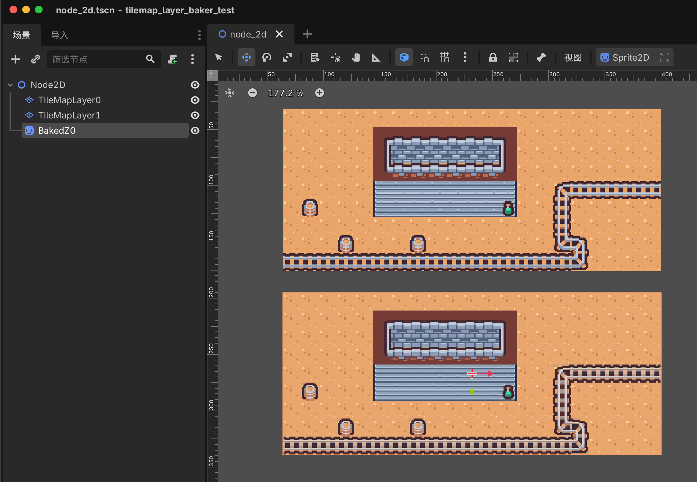
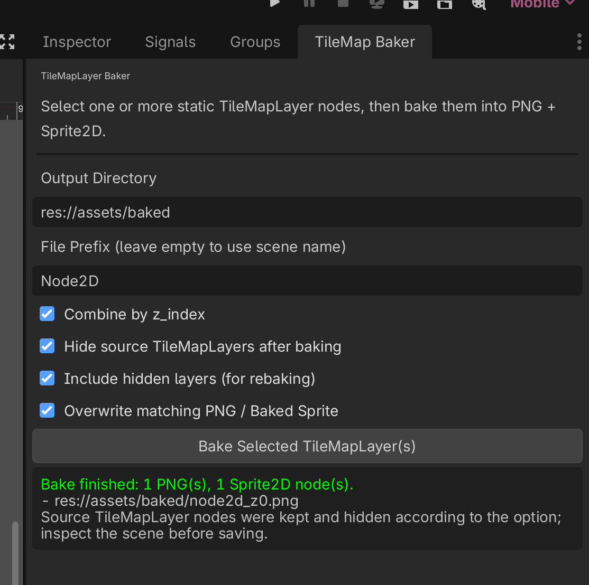

# TileMapLayer Baker

TileMapLayer Baker 是一个 Godot 4 编辑器插件，用于把选中的静态视觉 `TileMapLayer` 烘焙成 PNG 纹理，并在场景中生成对应的 `Sprite2D` 背景节点。

这个插件适合处理只负责画面表现、不需要在运行时继续保留 TileMap 行为的装饰层或背景层。把大型静态装饰层或背景层烘焙成 PNG + `Sprite2D` 后，可以用一个或几个普通精灵替代大量 tile cell，从而减少运行时 TileMap 处理和绘制准备开销。源 `TileMapLayer` 会继续保留在场景里，方便之后编辑和重新烘焙。

编辑器界面支持英文和简体中文。

## 截图





## 功能

- 将选中的 `TileMapLayer` 烘焙成 PNG 纹理。
- 在原父节点下创建对应的 `Sprite2D`。
- 可按 `z_index` 合并多个图层。
- 烘焙后可自动隐藏源 `TileMapLayer`。
- 支持重新烘焙已隐藏的源图层。
- 可覆盖同名 PNG 和已生成的 baked sprite。
- 编辑器界面支持英文和简体中文。

## 为什么要烘焙 TileMapLayer

TileMap 图层很适合编辑，但大型静态视觉图层在运行时仍然有成本。如果某个图层在游戏过程中不会变化，也不承担玩法数据，把它烘焙成 PNG-backed `Sprite2D` 可以让场景更轻。

比较适合烘焙的内容包括：

- 背景装饰。
- 大面积地面、墙体细节。
- 等距视角或密集的纯视觉地图。
- 面向低性能设备时，希望用少量纹理替代大量静态 tile 的场景。

## 安装

### 通过 Godot Asset Library

在 Godot Asset Library 中安装 **TileMapLayer Baker**，然后到 **项目 > 项目设置 > 插件** 中启用。

### 通过 Git

把下面这个目录复制到你的 Godot 项目中：

```text
addons/tilemap_layer_baker
```

然后在 **项目 > 项目设置 > 插件** 中启用 **TileMapLayer Baker**。

## 使用方法

1. 打开包含静态视觉 `TileMapLayer` 的 2D 场景。
2. 在场景树中选中一个或多个 `TileMapLayer`。
3. 打开 **TileMap Baker** 面板。
4. 设置输出目录，或保留默认值 `res://assets/baked`。
5. 点击 **Bake Selected TileMapLayer(s)**。
6. 保存场景前，检查生成的 `Sprite2D` 节点和 PNG 文件是否符合预期。

插件会保留原始 TileMapLayer。启用 **Hide source TileMapLayers after baking** 后，烘焙完成会隐藏源图层，让生成的 Sprite2D 承担视觉显示。

## 推荐工作流

- 不要烘焙承担玩法、碰撞、导航、触发器或动态变化的 TileMap 图层。
- 只烘焙纯视觉、静态的装饰层或背景层。
- 如果生成的 PNG 会随场景一起发布，请把它们提交到版本库。
- 修改源 TileMapLayer 后重新烘焙。

## 限制

- 插件是基于 TileSet 图集区域合成图片，不是视口截图工具。
- 支持轴向翻转的 tile。
- 任意旋转或缩放过的 `TileMapLayer` 烘焙后需要人工检查画面。
- 单次烘焙结果任意一边超过 8192 像素时会被拒绝，以避免生成过大的纹理。

## Asset Library 打包

仓库中保留了 demo 素材和截图用于开发展示，但 Godot Asset Library 下载包会通过 `.gitattributes` 只导出：

```text
addons/tilemap_layer_baker
```

这样用户安装时不会额外拿到测试场景、demo 素材或截图。

## 第三方素材

截图和本地 demo 场景可能使用 Kenney 制作的 **Tiny Dungeon**，授权为 CC0。插件代码本身不依赖这些素材。

## License

MIT。见仓库根目录的 `LICENSE`，插件发布包内也包含同一份许可文件。
